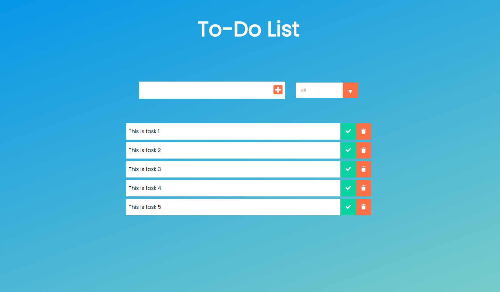

# React Todo App

A simple Todo App built with React.js that allows you to manage your tasks and stay organized.



## Features

- Add new tasks with descriptions.
- Mark tasks as completed.
- Delete tasks.
- Filter tasks by All, Active, or Completed.
- Clear completed tasks in one click.

## Technologies Used

- React.js
- HTML
- CSS
- JavaScript

## Getting Started

Follow these instructions to set up and run the project on your local machine.

1. **Clone the repository**:

   ```bash
   git clone https://github.com/your-username/react-todo-app.git
   cd react-todo-app
    ```
